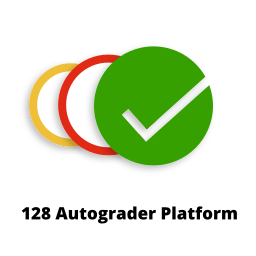

# The 128 Autograder Platform
> The battle tested code autograding platform for introductory students

Initially developed by Gregory Bell, currently maintained by Gregory Bell (gjbell [at] mines).

If you need support, please open an issue in this repo,
send the maintainers an email, 
or reach to out the maintainers on Teams (preferred).

If you are a student having an issue with the autograder: 
please reach out to your course staff for support as it is likely an issue with their implementation.

If you are a student trying to install the autograder as part of your course setup:
you are likely in the wrong place. 
CSCI128 students can find the course setup scripts in [CSCI128/CourseSetup](CSCI128/CourseSetup).

## What is this?
This is the monorepo for the 128 Autograder Platform source code.

Currently, there are language bindings for Python and IPython (via Jupyter Notebooks).
If you have a language request, 
please reach out to Gregory Bell to discuss your needs and if you would be best served by this platform.

## What is this not?
This is not where you should be developing assignments or autograders for assignments.

## Who is this for?
Anyone who wants to save time grading programming assignments and spending more time supporting students.

This has been deployed for thousands of introductory level python students since Fall of 2023,
and has saved CS@Mines thousands of grading hours allowing course staff to spend more time supporting students.

## What sets this platform apart?
It has native support for running locally on students' machines (we have deployed on Windows, macOS, many flavors of Linux, and even ChromeOS).
This allows students to get rapid feedback on their code with public test cases.

It has native support for Gradescope's autograder, 
allowing students to submit their final code for grading against all the public *and private* test cases.

It has native support for PrairieLearn's external grading platform, 
allowing all the benefits of PrairieLearn's learning through mastery philosophy.

It supports:
- Transparently mocking out external libraries (like matplotlib)
- Dynamically injecting code into student's submissions
- Flexible execution modes
- Grabbing variables from the student's submission
- Complex file IO
- Dynamically installing external libraries
- Allowing students to define their own test cases
- Complex submission structures

If have an idea for how you want to test a student's submission, odds are, this platform can accommodate you.

## Installation (for students)

We highly recommend 
that course instructors give students a setup script to automatically install the dependencies needed for their course.

You can see CSCI128's setup scripts here: [CSCI128/CourseSetup](CSCI128/CourseSetup).

Note: Python 3.12 now refuses to install into the system directory by default (for good reason).
You may need to pass the `--break-system-packages` flag to allow the installation
(not recommended) or use virtual environments
(slightly more recommended).
However, with CSCI128,
we lean on the `--break-system-packages` method
as students found the usage of virtual environments to be very confusing.

You can also likely use `pipx` but, that has not been tested so your milage may vary.

If you needed to install the 128Autograder for a Python class, you would run:

```shell
pip install 128Autograder[python]
```
Note the name of the language in the brackets, those are called 'extras' in pip-land.

They allow you to only install the dependencies that you need.

Each language that this platform supports is provided as an extra
so that you don't need to install extra stuff that you aren't going to use.


## Installation (for assignment developers)

```shell
pip install 128Autograder[python-dev]
```

## Installation (for maintainers)

```shell
cd core
pip install -e '.[dev]'
cd ../language_binds/python
pip install -e '.[dev]'
```
